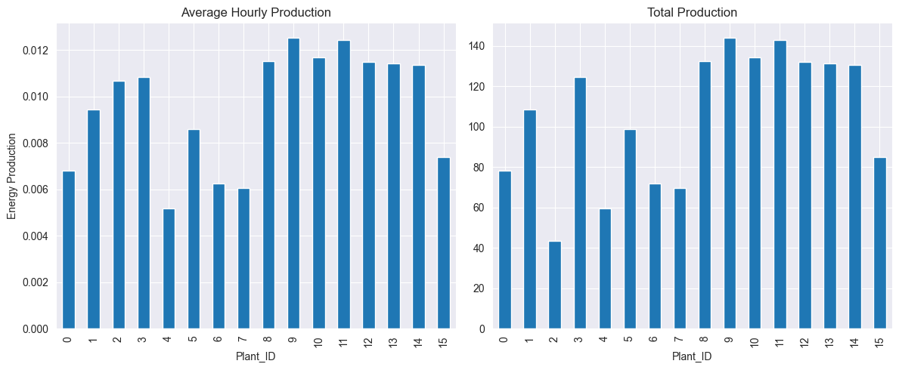
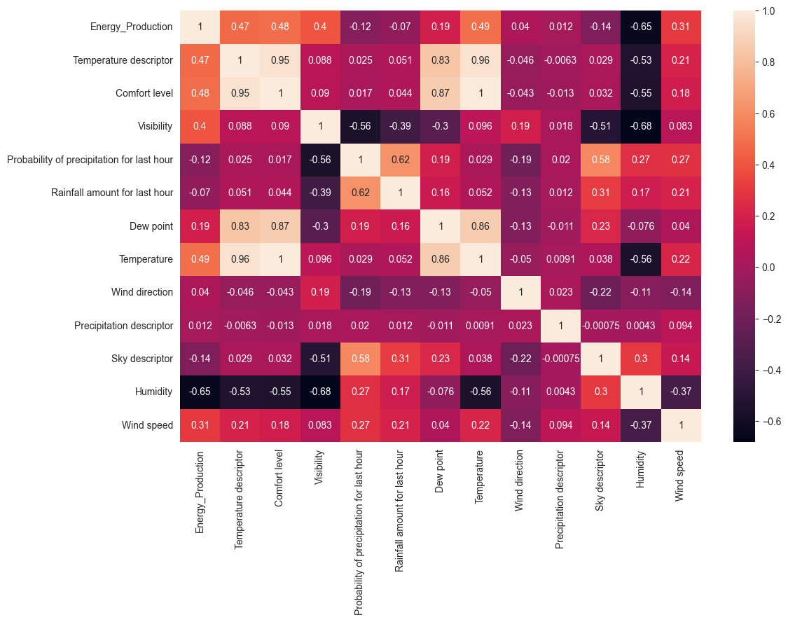
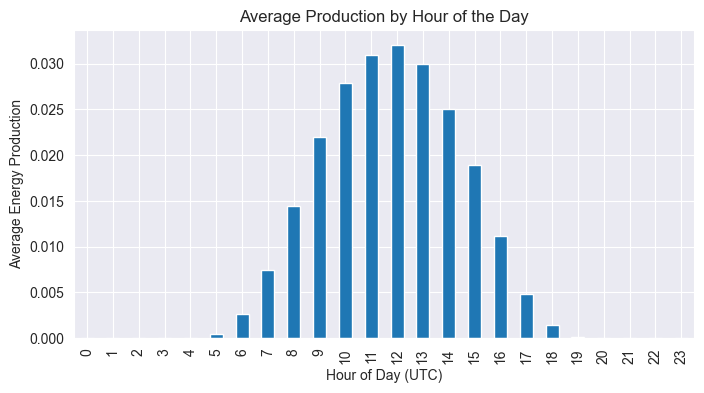
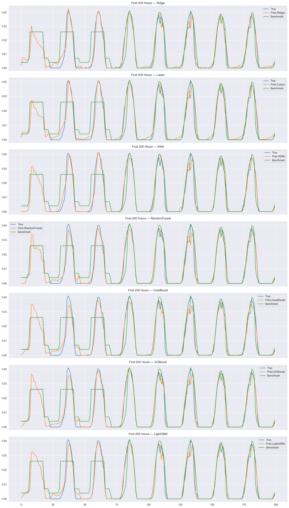
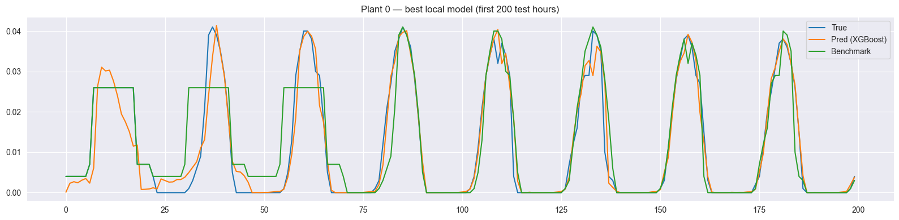
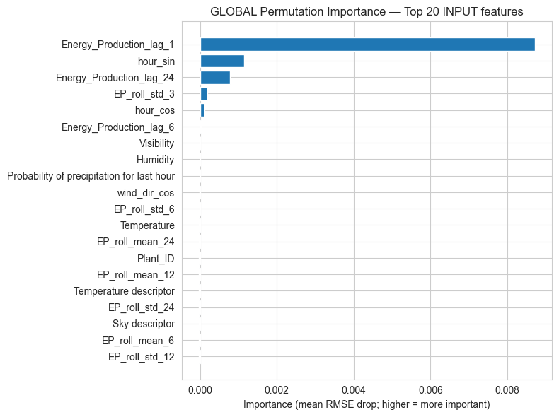
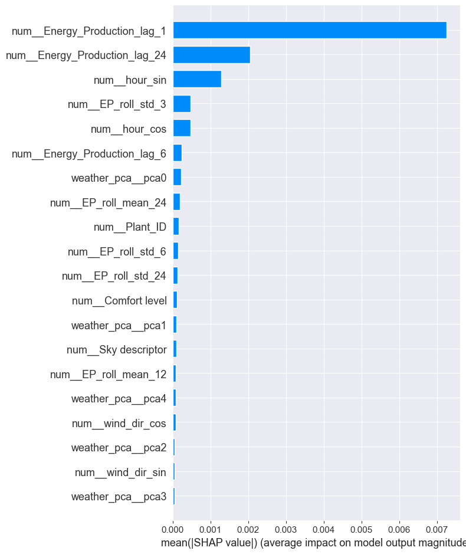
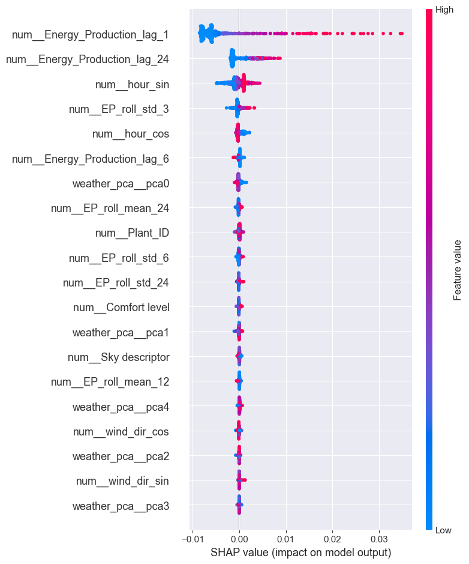
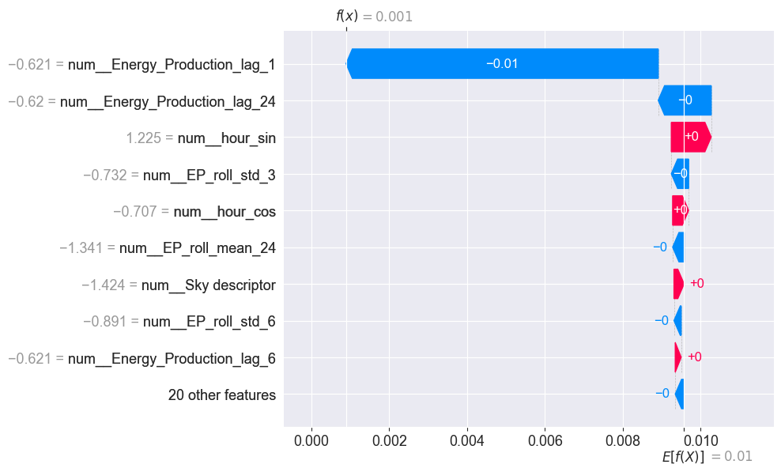

# Energy Production Forecasting

Forecasting hourly solar generation for a panel of solar power plants using weather, time, plant identity, and recent production history.

The project is implemented as a single exploratory and modeling notebook: [`project_VClean_2.ipynb`](project_VClean_2.ipynb). It builds an end-to-end machine learning workflow, compares global and plant-specific models, and evaluates whether learned forecasts improve on the provided `Benchmark` forecast.

## Project Goal

The dataset contains hourly observations for solar plants identified by `Plant_ID`, with:

- actual `Energy_Production`
- a provided `Benchmark` forecast
- weather descriptors such as temperature, humidity, visibility, wind, precipitation, and sky condition
- timestamped observations in UTC

The main question is:

> Can machine learning forecasts outperform the provided benchmark forecast on unseen hourly production data?

## Approach

The notebook follows a chronological forecasting workflow rather than a random split. This matters because the task is time-dependent: future production should only be predicted using information that would have been available in the past.

### 1. Data Loading And Sanity Checks

The notebook downloads the train and test CSV files, parses `UTC Time`, sorts observations chronologically, checks missing values, and inspects the panel structure.

The training set has `176,505` rows and the test set has `59,376` rows. No missing values are reported in either file.

### 2. Exploratory Data Analysis

The EDA confirms three useful forecasting signals:

- plants have different average and total production profiles
- production follows a strong daily solar cycle
- weather variables are correlated with production, but also with each other







### 3. Feature Engineering

The feature set combines static, weather, time, and history-based signals:

- cyclical encodings for hour, month, and wind direction
- calendar features such as hour, day of week, and month
- plant identity through `Plant_ID`
- lagged energy production by plant
- rolling mean and rolling standard deviation by plant
- weather features with numeric preprocessing
- categorical encoding for day/night and descriptor columns

Lag and rolling features are computed within each plant to avoid mixing histories across different production sites.

### 4. Modeling Strategy

Two forecasting strategies are compared:

**Global models** train one model across all plants. They use `Plant_ID` and engineered features to learn shared behavior while still accounting for site-level differences.

**Local models** train separate models per plant. This lets each plant have a specialized model for its own production profile.

The notebook evaluates several model families:

- Ridge and Lasso regression
- K-nearest neighbors
- Random Forest
- Gradient Boosting
- XGBoost
- LightGBM

Preprocessing and models are wrapped in scikit-learn pipelines. Hyperparameters are tuned with chronological validation so that model selection respects time order.

## Results

The best global model is **LightGBM**.

| Evaluation | Model RMSE | Benchmark RMSE | Model R2 | Benchmark R2 | RMSE improvement |
| --- | ---: | ---: | ---: | ---: | ---: |
| Global test set | 0.002873 | 0.007067 | 0.937603 | 0.622516 | 59.34% |
| Local best-per-plant average | 0.002826 | 0.006664 | 0.930280 | 0.632353 | 57.59% |

Both strategies substantially outperform the benchmark on RMSE and R2. The global LightGBM model is slightly stronger on overall R2, while the local strategy achieves a slightly lower average RMSE across plants.

The forecast plots show that the trained models track the shape of observed solar production more closely than the benchmark, especially around daytime peaks.





## Model Interpretation

The interpretation section uses permutation importance and SHAP-style diagnostics to understand what drives predictions.

The strongest signals are recent production history, the daily cycle, and plant-specific behavior. This is intuitive for solar generation: production is strongly constrained by sunlight timing, recent operating conditions, and each plant's capacity/profile.









## Repository Structure

```text
.
├── README.md
├── project_VClean_2.ipynb
├── requirements.txt
└── docs/
    └── images/
        ├── global-forecast-comparison.png
        ├── hourly-production-profile.png
        ├── local-plant0-forecast.png
        ├── permutation-importance.png
        ├── plant-production.png
        ├── shap-importance.png
        ├── shap-summary.png
        ├── shap-waterfall.png
        └── weather-correlation-heatmap.png
```

## How To Run

Create an environment and install the dependencies:

```bash
python3 -m venv .venv
source .venv/bin/activate
pip install -r requirements.txt
```

Then open and run:

```text
project_VClean_2.ipynb
```

The notebook downloads the source CSV files directly from GitHub, so no local dataset files are required.

## Key Takeaway

Machine learning adds clear value for this forecasting task. A global LightGBM model and specialized per-plant models both beat the benchmark by more than 50% RMSE on the test data, with interpretable drivers that match the physics of solar production: sunlight timing, recent generation, plant identity, and weather conditions.
